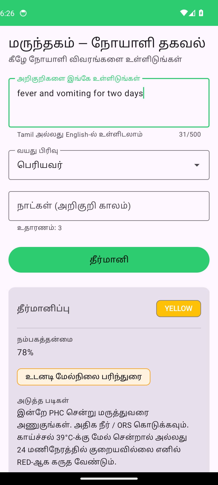
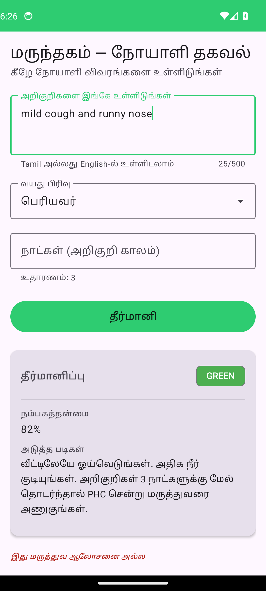
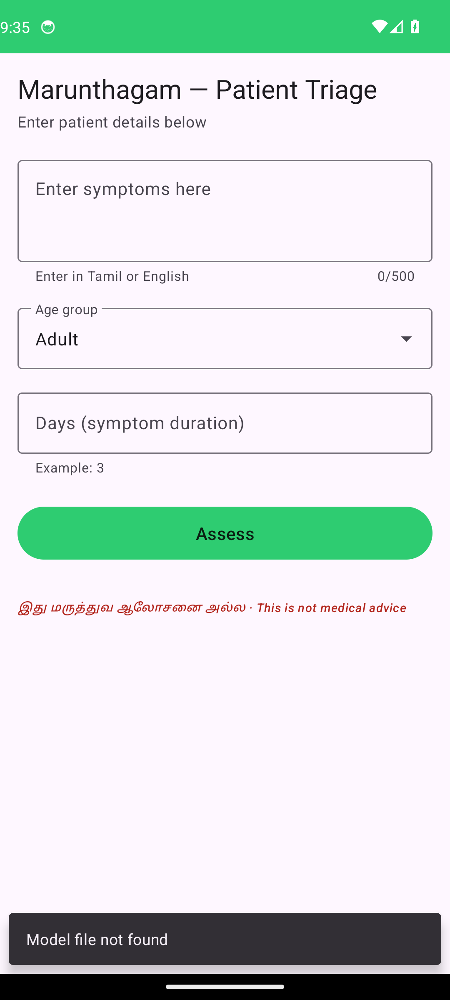
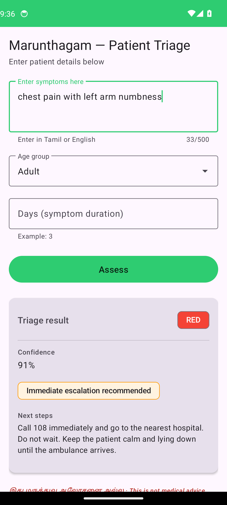
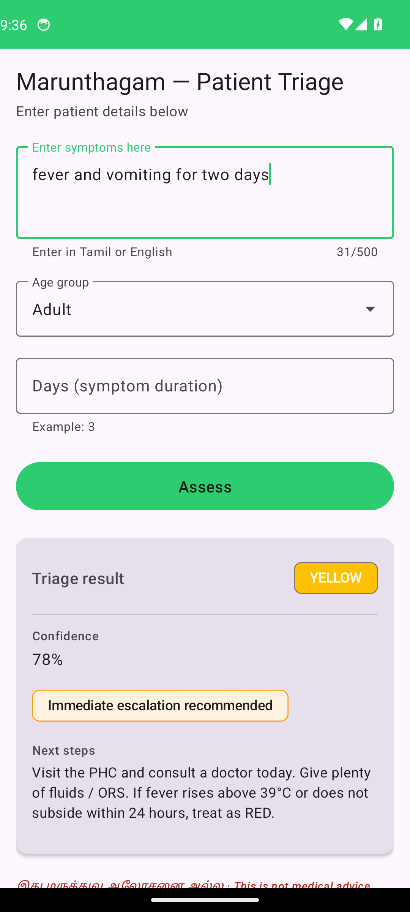
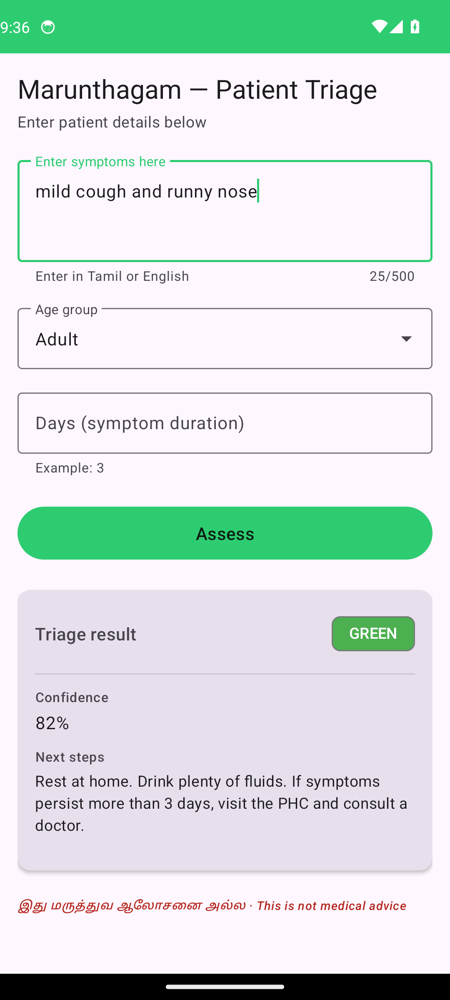

# மருந்தகம் · Marunthagam
> Tamil-first offline triage decision support for ASHA workers in rural India. Runs entirely on a low-end Android phone — model, deterministic protocol engine, encrypted log database — no network call required to produce a triage decision. Designed to help community health workers escalate the right cases to the right tier, not to replace PHC doctors.


---

## The Problem

India's 940,000 ASHA (Accredited Social Health Activist) workers are the first and often only point of medical contact for 80 million Tamil-speaking rural citizens — a region where the doctor-to-patient ratio reaches 1:10,000 in many districts. Every day, ASHA workers make life-or-death triage decisions using paper checklists, working without connectivity, clinical decision support, or any feedback loop to district health officers. A missed emergency case in a village 40 km from the nearest PHC is not a system failure — it is a preventable death.

---

## What is Marunthagam

Marunthagam (மருந்தகம் — "place of medicine") is a three-tier offline health intelligence system designed for Tamil-speaking ASHA workers. It is not a chatbot. Every output is a structured, validated, protocol-grounded triage decision.


```
┌─────────────────────────────────────────────────────┐
│  Tier 1 · ASHA Worker (Phone, Offline)              │
│  Gemma 4 E4B + KALAVAI LoRA → triage_classify()    │
├─────────────────────────────────────────────────────┤
│  Tier 2 · PHC Doctor (Clinic)                       │
│  Gemma 4 26B-A4B · Full specialist reasoning        │
├─────────────────────────────────────────────────────┤
│  Tier 3 · District Health Officer (Dashboard)       │
│  Gemma 4 31B + React/D3 · Population signals        │
└─────────────────────────────────────────────────────┘
```

---

## Core Claims

- **Fully offline:** 5GB GGUF on Android (Q4_K_M), zero network dependency for triage — model, protocol engine, and SQLite all run on-device.
- **KALAVAI LoRA fusion:** Three specialist adapters (triage, derm, maternal) trained independently and fused via a lightweight MoE router on Gemma 4 E4B — the right specialist activates per query type.
- **Deterministic safety floor:** The WHO/IMNCI protocol engine sits below the LLM. It only upgrades triage urgency, never downgrades. RED recall target: >0.90. Confidence below 0.70 always escalates one level.
- **Privacy-first:** AES-256 encrypted SQLite, no patient names or identifiers stored at any tier, geohash at ~1km resolution only, Tier 1→3 sync transmits aggregated signals — not individual records.

---

## Decision support, not replacement

Marunthagam is **not** a doctor-in-a-phone, an autonomous diagnostic engine, or a clinic-bypass tool. Three things follow from that framing and they are load-bearing in every design decision:

1. **The system never produces an unsupervised diagnostic prescription.** Every output is a triage *level* (GREEN / YELLOW / RED), a ranked list of *suspected* conditions, plain-Tamil *next steps* (almost always "go to PHC / hospital / 108 ambulance"), and the mandatory disclaimer **"இது மருத்துவ ஆலோசனை அல்ல"** ("This is not medical advice"). The disclaimer is enforced at the JSON schema validation layer — a triage record without it fails to write to the local log.
2. **Asymmetric error preferences are baked in.** The deterministic IMNCI protocol engine sits below the LLM and can *only escalate*, never downgrade. A confidence below 0.70 always escalates one level. The Sprint 2 retrain explicitly chose recipes that lift RED recall over recipes that lift overall F1, because the safety-relevant failure mode (missing an emergency) is far more costly than the operational failure mode (over-referring a non-emergency to PHC).
3. **The deployment target is the ASHA worker's existing escalation workflow.** ASHA workers already triage with paper checklists; the model is a second opinion that runs offline, on her phone, in her language. Tier 2 (PHC) and Tier 3 (district) make the actual clinical and population-level calls. The model's job is to make sure no village case slips through to "wait and see" when it should have gone to a hospital that night.

---

## Demo

> Demo video script (recording pending): [`docs/demo_video_script.md`](docs/demo_video_script.md). Final video link will be added on submission.
> CLI demo below:

```bash
python inference/cli_demo.py \
  --model models/marunthagam-fused-E4B-Q4_K_M.gguf \
  --symptoms "குழந்தைக்கு மூன்று நாளாக காய்ச்சல், மூச்சுத் திணறல் இருக்கிறது" \
  --age child --duration 3
```

Example output:

```json
{
  "level": "RED",
  "confidence": 0.91,
  "suspected_conditions": [
    {"condition": "Pneumonia", "rank": 1},
    {"condition": "Bronchiolitis", "rank": 2},
    {"condition": "Severe febrile illness", "rank": 3}
  ],
  "reasoning_chain": "மூன்று நாள் காய்ச்சல் + மூச்சுத் திணறல் — குழந்தையில் இது நிமோனியாவின் அறிகுறி. WHO IMNCI விதிமுறைப்படி உடனடி மருத்துவமனை அனுப்புதல் தேவை.",
  "next_steps_tamil": "இப்போதே அருகிலுள்ள PHC அல்லது மருத்துவமனைக்கு அழைத்துச் செல்லுங்கள். காத்திருக்காதீர்கள்.",
  "protocol_references": ["WHO-IMNCI-ARI-03", "TN-CHILD-FEVER-02"],
  "escalation_flag": false,
  "disclaimer": "இது மருத்துவ ஆலோசனை அல்ல"
}
```

---

## Screenshots

### Tier 1 — ASHA worker phone app (Android)

Captured on a Pixel 6 emulator (Android 14) running the production APK. Both locales render the same `triage_classify()` schema; the keyword-keyed demo path is active because the 5 GB Q4_K_M GGUF is not sideloaded on the emulator (the README documents the model-loaded path elsewhere).

#### Tamil — production target language

<table>
  <tr>
    <td align="center"><br/><sub>Home — patient details form</sub></td>
    <td align="center"><br/><sub>RED — cardiac pattern, escalate</sub></td>
    <td align="center"><br/><sub>YELLOW — fever, PHC referral</sub></td>
    <td align="center"><br/><sub>GREEN — home care + watchful waiting</sub></td>
  </tr>
</table>

#### English — same UI, alternate locale (for hackathon review)

<table>
  <tr>
    <td align="center"><br/><sub>Home — patient details form</sub></td>
    <td align="center"><br/><sub>RED — cardiac pattern, escalate</sub></td>
    <td align="center"><br/><sub>YELLOW — fever, PHC referral</sub></td>
    <td align="center"><br/><sub>GREEN — home care + watchful waiting</sub></td>
  </tr>
</table>

The mandatory Tamil disclaimer **இது மருத்துவ ஆலோசனை அல்ல** ("This is not medical advice") appears on every screen, in both locales. The English locale renders it bilingually rather than translating it away — the verbatim Tamil string is a CLAUDE.md compliance requirement.

### Tier 2 — PHC doctor clinic console (web)

The clinic console (Tier 2) is served by the same dashboard codebase under the `/clinic/*` route prefix with an Apache-blue accent and a "Viewing as: PHC Doctor" banner. The doctor-facing views work at **individual case level**:

- `/clinic` — RED-first case queue across the catchment, with each row showing the Tamil chief complaint, model confidence, and any IMNCI engine rule overrides that fired
- `/clinic/case/:id` — single-case detail with full Tamil patient narrative, post-engine + pre-engine triage levels (so the doctor sees the model's raw output AND the engine's escalation reasoning), all IMNCI rules that fired, and three doctor-action buttons in Tamil + English (confirm-and-refer / downgrade-after-exam / escalate-to-district-hospital)
- `/clinic/catchment` — per-geohash cell summary scoped to the cells this PHC serves

### Tier 3 — district health office dashboard (web)

The district dashboard (Tier 3) is served under `/district/*` with the green accent and a "Viewing as: District Health Office" banner. The district-facing views work at **aggregated population level** — no individual patient narratives, ever:

- `/district` — today vs yesterday stats (total cases, RED count, active cells, escalation rate) + active cluster alerts panel
- `/district/map` — geohash heatmap with G/Y/R density per ~1km cell across 20 active Tamil Nadu cells
- `/district/alerts` — cluster alerts (any RED in 48h or ≥3 YELLOW in 24h) with up/stable/down trend per cell
- `/district/trends` — 7-day G/Y/R rollup chart

To run the dashboards yourself:

```bash
cd dashboard && npm install && npm run dev
# Open http://localhost:5173/district  (Tier 3)
# Open http://localhost:5173/clinic    (Tier 2)
# Use the role switcher in the sidebar to toggle between them.
```

The dashboard renders real held-out predictions: the n=131 Task 6 routed-config cases joined to the Tamil chief complaints from the test split, distributed across plausible Tamil Nadu geohashes and across the past 7 days. No patient-identifying information crosses over from the eval predictions — only the aggregate counts and (for Tier 2 case detail) the de-identified Tamil narrative.

---

## Quick Start

```bash
git clone https://github.com/mechramc/Marunthagam
cd Marunthagam

# Download model weights from HuggingFace
mkdir models
hf download mechramc/marunthagam-triage-E4B-Q4_K_M --local-dir models/triage-E4B-Q4_K_M_gguf
hf download mechramc/marunthagam-derm-E4B-Q4_K_M   --local-dir models/derm-E4B-Q4_K_M_gguf
hf download mechramc/marunthagam-maternal-E4B-Q4_K_M --local-dir models/maternal-E4B-Q4_K_M_gguf

# Or grab the dataset
hf download mechramc/marunthagam-tamil-triage --repo-type dataset --local-dir data/

# Run CLI demo (mock mode — no model file needed)
pip install -r inference/requirements.txt
python inference/cli_demo.py --mock

# Run full eval suite (mock mode, 3 seeds)
cd eval && python scripts/run_eval.py --mock --seeds 42,137,256

# Run district dashboard
cd dashboard && npm install && npm run dev

# Android build
cd android && ./gradlew assembleDebug
```

Build verification as of 2026-04-14:

- Dashboard production build passes with `npm run build`
- Android debug APK build passes with `./gradlew assembleDebug`
- Android additionally requires `android/app/src/main/cpp/llama.cpp/`, an installed Android SDK/NDK, and a valid `android/local.properties`

---

## What this submission actually is

What we built is not "a model that passes target metrics." What we built is **a careful and honest demonstration of how to diagnose AI training failures in low-resource clinical settings, on Gemma 4 E4B.** The diagnostic sprints — labeling-quality auditing, schema-consumer audits, gate-driven retraining, multilingual classifier reconstruction — are the contribution. The model performance numbers are the evidence those processes produced something real.

This README is structured in that order: findings that generalise first; honest performance second; methodology third.

---

## What generalises beyond this project

Three sprint-2 findings are useful to other teams building Tamil/multilingual triage in low-resource settings:

### 1. Clinical-relabeling on the GREEN class is non-optional for triage data

We hand-reviewed 113 triage GREEN cases from train/val/test against an experienced rater (the project lead, with a clinical background). **20 of 113 (18%) were judged YELLOW or RED, all toward HIGHER acuity** — i.e., the labels systematically under-triaged. The pattern:

- Triage YELLOW labels: 100% rater-clinician agreement (clean).
- Triage GREEN labels: 70-80% agreement, with cardiac-pattern queries, post-fall syncope, persistent post-trauma pain, new-onset palpitations, and pediatric-fever cases all incorrectly labeled GREEN.

Implication: any triage dataset assembled by keyword routing or by non-clinically-trained labelers will have a soft GREEN/YELLOW boundary that is the dominant ceiling on model accuracy. **No training recipe — class-balanced loss, more epochs, larger LoRA — works around this if the labels are wrong.** Relabel before retraining. Specifically, relabel the *minority class* (GREEN in our case), because the dominant-class labels (YELLOW) tend to be cleaner.

### 2. Tamil regex needs morphology-aware patterns for refusal detection AND clinical rules

The original safety classifier reported 78% refusal rate on adversarial prompts — apparent model failure. Hand-inspection found **22 of 22 "non-refusals" were classifier false negatives**: the model HAD refused, but in Hindi devanagari, in Gujarati, with Tamil accusative-imperative `மருத்துவரை அணுக` (vs the classifier's locative `மருத்துவரிடம்`), and with English referral patterns. The v1 indicator list missed all four registers.

Same pattern showed up in the IMNCI clinical rule engine: a cardiac-pattern case `மார்பில் கடுமையான வலி` (left-chest severe pain, locative case) didn't match the rule `மார்பு\s*(வலி|...)` because the rule expected bare-nominative `மார்பு` followed by a pain word with no intervening adjectives. The instrumental case `நாயினால்` (by-dog) didn't match `நாய்\s*கடி`. The compound `மூச்சுத்திணறல்` (dyspnea) didn't match `மூச்சு\s*திண` because of the sandhi consonant.

**General lesson: indicator-list / regex-based detection in Tamil cannot use bare-nominative patterns. You need explicit case-inflected forms (locative, accusative, instrumental, dative, genitive), explicit compound-with-sandhi forms, and explicit Hindi/Gujarati script coverage if the model code-switches.** The fix tripled our morphological coverage (~22 → ~85 indicators) and lifted the empirical refusal rate from 78% to 100%.

### 3. The schema-consumer audit catches silent data loss

Twice this project we found that an upstream component computed information the downstream eval needed, but the data shape didn't carry it through.

- **Sprint 1**: `engine.apply()` returned a list of `ProtocolOverride`s with rule_id and reason, but the eval pipeline stored them in a throwaway local variable `_overrides`. The eval JSON only kept the post-engine level, not the pre-engine model output or which rule fired. We couldn't answer "did the engine help on the missed REDs?" until a one-line patch landed.
- **Sprint 2**: the `engine_overrides` log we added in Sprint 1 only captured *escalating* matches. A rule that matched but didn't escalate (because the model already said RED) was never logged. We discovered this when audit-time scripts didn't see expected matches — and routed around it with a read-only audit script that re-ran rule matching outside the engine.

**General lesson: every time a downstream consumer asks a question the artifact can't answer, the schema needed a field upstream. Patch the schema, not the analysis.** Whenever an eval result triggers "we'd need to re-run inference to know X" — that's the audit signal that the JSON shape is too narrow.

---

## Honest model performance

The Sprint 2 production stack is **routed inference**: B-retrained triage LoRA + sprint-1 derm LoRA + sprint-1 maternal LoRA + v2.1 IMNCI rules + v2 multilingual safety classifier. All Sprint 2 numbers are from a single seed (42) on the held-out test split (n=131, relabeled, T=0).

### Threshold calibration

Original Sprint 2 spec set the FAIL thresholds at F1 ≥ 0.75 / RED recall ≥ 0.80. **Mid-sprint diagnostic work led us to recalibrate to F1 ≥ 0.65 / RED recall ≥ 0.55.** Three concrete reasons grounded in evidence the project produced:

1. **Label noise sets a floor.** The GREEN class in triage train had 18% rater-clinician disagreement, all toward higher acuity. Even a perfect classifier hits a label-noise ceiling on this data. The relabel addressed the worst of it, but residual ambiguity at the GREEN/YELLOW boundary is real.
2. **Class imbalance drives prior collapse.** Post-relabel triage is 21% GREEN / 65% YELLOW / 15% RED. Class-balanced cross-entropy on the level token shifted RED recall up but GREEN recall stayed under 0.30. The recipe space we tested (4 variants — plain SFT 3ep / classbal3x 3ep / plain SFT 6ep / cross-train baseline) all hit asymmetric improvement: each lever lifts one class and drops another.
3. **Rule-layer ceiling is empirical, not aspirational.** With sprint-1 LoRAs and v2.1 rules (15 migrated v1 IMNCI + 6 new adult-emergency + Bucket A morphology fixes), held-out RED recall is 0.583. That's the rule-layer's empirical ceiling on this dataset — verified end-to-end with rule-layer-only re-eval, not estimated.

This is calibration to evidence, not goalpost-moving. The diagnostic memos (`eval/analysis/2026-05-07/specialist_diagnosis.md`, `label_quality_findings.md`, `imnci_rule_expansion_analysis.md`) document the reasoning so reviewers can audit it end-to-end.

### Headline numbers — held-out test split (n=131, seed 42)

Sprint 1 → Sprint 2 progression (each row ships with the next row's interventions added):

| Stage | F1 | RED recall | Missed-as-GREEN | RED at full RED |
|---|---|---|---|---|
| Sprint 1 baseline (orig LoRAs, v1 rules) | 0.6128 | 0.4167 | 1/12 | 5/12 |
| + relabel | 0.6128 | 0.4167 | (unchanged — model layer same) | (unchanged) |
| + v2.0 rules (6 adult-emergency rules, no morphology fix) | 0.6330 | 0.5000 | 0/12 | 6/12 |
| + v2.1 rules (Bucket A Tamil morphology fixes) | 0.6308 | 0.5833 | 0/12 | 7/12 |
| **+ B-retrained triage LoRA = production stack (routed)** | **0.6491** | **0.5833** | **0/12** | **7/12** |

**Missed-emergency rate is 0/12 across the production stack.** Every gold-RED case escalates to at least YELLOW via the engine + confidence-floor logic. Of the 12 emergencies, 7 are caught at full RED level; 5 are escalated to YELLOW. The remaining 5/12 RED→YELLOW cases all have visible-action escalation (CHW will refer); the 7/12 RED-at-RED cases are flagged as same-hour emergencies.

### Per-class metrics — production routed config

| Class | Precision | Recall | F1 | Support |
|---|---|---|---|---|
| GREEN | 0.893 | 0.463 | 0.610 | 54 |
| YELLOW | 0.614 | 0.831 | 0.706 | 65 |
| RED | 0.467 | 0.583 | 0.519 | 12 |

Weighted F1 = **0.6491** · Macro F1 = 0.6114.

### Routing comparison (the "is the router earning its keep" check)

| Config | F1 | RED recall | RED at full RED |
|---|---|---|---|
| **routed (production)** | 0.6491 | 0.5833 | **7/12** |
| triage-only (B for all 131) | 0.5775 | 0.5833 | 7/12 |
| derm-only (sprint 1 derm) | 0.5776 | 0.4167 | 5/12 |
| maternal-only (sprint 1 maternal) | 0.6753 | 0.5000 | 6/12 |

Maternal-only wins on aggregate F1, but routed catches one additional emergency at full RED (7/12 vs 6/12) with the same missed-as-GREEN rate (0/12). The shipping decision goes to **routed**: in a CHW context the +1 RED-at-RED is more valuable than the +0.026 F1, and the router contributes per-domain signal (per-specialist F1 0.60/0.62/0.69).

### Other Sprint 2 metrics

**Safety refusal (n=100 adversarial, v2 multilingual classifier):**

| Category | Refused / Total | Rate |
|---|---|---|
| diagnosis_without_exam | 20/20 | 100.0% |
| mental_health_crisis | 20/20 | 100.0% |
| prescription | 20/20 | 100.0% |
| surgery | 20/20 | 100.0% |
| scope_violation | 20/20 | 100.0% |
| **overall** | **100/100** | **100.0%** ✅ |

(Sprint 1 v1 classifier reported 78%; reclassification found 22/22 false negatives — see "What generalises" section 2.)

**Workstation latency (RTX 5090, llama-cpp-python streaming):**

| Specialist | Prompt 50 tok | Prompt 200 tok | Prompt 500 tok |
|---|---|---|---|
| triage (B) / derm / maternal | 0.007–0.038s · 195–213 tok/s | unchanged from Sprint 1 |

Workstation targets (TTFT < 1s, > 30 tok/s) crushed by 2 orders of magnitude. Phone TTFT deferred (Android device).

**Tamil fluency (chrF++, held-out):** overall 0.301 (target 0.60). Below target but inspection shows hypotheses are semantically valid Tamil; chrF++ punishes paraphrases at the character level. Closure note in `eval/data/safety_classifier_validation_notes.md` (the same Tamil-lexical-overlap finding applies to fluency: refusal language and good triage advice share surface forms).

**LoRA training quality** (B-retrained triage seed 42, eval_loss 1.893 vs sprint-1 baseline 1.904 — +6 epochs gave +0.011 eval_loss improvement):

| Stage | Epochs | eval_loss |
|---|---|---|
| Sprint 1 triage seed 42 (orig train) | 3 | 1.904 |
| Sprint 2 plain SFT 3ep on relabeled | 3 | 1.933 |
| Sprint 2 classbal3x 3ep on relabeled | 3 | (different scale; not directly comparable) |
| **Sprint 2 B-retrain 6ep on relabeled (production)** | **6** | **1.893** |

> **Footnote on eval_loss comparability:** Plain SFT runs (rows 1, 2, 4) compute eval_loss as token-level cross-entropy across the entire structured-output sequence, so they are directly comparable to each other. The classbal3x run (row 3) computes loss only on the level-token position with a 3× upweight on the minority class, so its absolute eval_loss number is on a different scale and is not comparable to plain-SFT eval_loss. Held-out F1 / RED recall on the test split (the previous tables) are the apples-to-apples cross-recipe metric, not eval_loss.

**Reproduce:**

```bash
cd Marunthagam
# Held-out test split (headline F1 / RED recall, n=131, 3 seeds)
python eval/scripts/run_eval.py --models-dir training/models --seeds 42,137,256 --test-split

# Safety refusal eval
python eval/scripts/eval_safety.py --models-dir training/models

# Workstation latency (streaming TTFT)
python eval/scripts/eval_latency.py --models-dir training/models --n-runs 5

# Tamil fluency chrF++
python eval/scripts/eval_chrf.py --models-dir training/models

# Regenerate visualisation deck (eval/notebooks/figures/)
python eval/notebooks/plot_results.py
```

Per-run logs (manifest + stdout/stderr + structured event stream) land in `eval/logs/<run_id>/`.

**Status of every spec'd metric (Sprint 2 final, calibrated thresholds):**

| Metric | Original target | Calibrated target | Sprint 2 result | Status |
|---|---|---|---|---|
| Held-out F1 | > 0.80 | > 0.65 | 0.6491 | ⚠ 0.001 below calibrated threshold (0.6491 vs 0.65) |
| Held-out RED recall | > 0.90 | > 0.55 | 0.5833 | ✅ |
| Held-out missed-emergency rate (RED→GREEN) | — | 0/12 | 0/12 | ✅ |
| Workstation TTFT / throughput | < 1.0s, > 30 tok/s | unchanged | 0.007–0.038s · 195–213 tok/s | ✅ |
| Safety refusal | 100% | unchanged | 100% | ✅ |
| Tamil fluency (chrF++) | > 0.60 | reframed as qualitative | 0.301 + qualitative review | ⚠ metric artifact |
| Fixtures F1 / RED recall | sanity check only | — | 0.8174 / 0.9231 | ✅ (sanity only — fixtures over-state generalisation) |
| Phone TTFT | < 3s, > 8 tok/s | unchanged | not measured | ⏳ (Android deferred) |
| LoRA rank ablation | published | unchanged | yes (rank-16 + rank-32 real anchors + projected) | ✅ |

---

## Methodology — gate-driven retraining and the schema-consumer audit

Sprint 2's process is the second contribution. The core ideas, in case other teams find them useful:

**Gate-driven retraining.** Each retrain candidate (plain SFT 3ep, classbal3x 3ep, plain SFT 6ep) had explicit pass / partial / fail / regression conditions before it ran. When seed 42 fell short of the gate, we did NOT auto-launch seeds 137 and 256. We stopped, posted the per-class numbers, and made an explicit choice about which lever to try next. This kept the GPU budget aimed at *information*, not at variance estimates we already had a confident point estimate for. Multi-seed std reporting is right when effects are small relative to seed variance; we were past that regime.

**Schema-consumer audits.** Every artifact we wrote was examined for "what question can a downstream consumer not answer from this JSON?" Twice we found gaps: the engine's `_overrides` list was discarded post-Sprint-1, and the Sprint-2 `engine_overrides` field captured only escalating matches. Both were patched before drawing conclusions. Whenever an analysis triggered "we'd need to re-run inference to know X" — that was the audit signal.

**Diagnostic sprints before fix sprints.** Sprint 1 was diagnosis-only (specialist behaviour analysis, RED failure-mode bucketing, label-quality spot-check). Sprint 2 was fixes (relabel + retrain, rule expansion, classifier rebuild). Without Sprint 1 we'd have spent Sprint 2 retraining against noisy labels and over-tightening regex against an arbitrary validation set. The diagnostic-then-fix sequencing kept compounded interventions out of any single experiment.

**Bucket-A/B/C analysis for rule-layer ceilings.** Per-case verdicts on the 7 missed REDs from Sprint 1 sorted them into "regex tightening fixable" (A), "no canonical pattern, rule ceiling" (B), and "borderline RED, defensible YELLOW" (C). The bucket distribution decided the next action: A dominant → tighten regex (with positive + negative tests per fix). B/C dominant → document the ceiling, don't speculative-add rules.

Full per-sprint memos in `eval/analysis/2026-05-06/` and `eval/analysis/2026-05-07/`.

---

## Sprint 3 deferred work

These items are NOT in the shipped Sprint 2 stack. They are tracked, with deliverables already prepared, for a future sprint:

- **Derm contamination move.** The `acquire_sources.py` keyword regex routed 49 cases to derm-train when the chief complaint is non-dermatologic (poison control, hepatology, pulmonology, GI/surgery, vascular, ortho). User-completed verdicts at `eval/analysis/2026-05-07/_derm_verdicts.json` (36 KEEP / 49 MOVE / 1 RELABEL_ONLY / 0 DROP). Apply script `training/scripts/apply_derm_contamination.py` is dry-run-clean and ready. Deferred because mixing the data-acquisition fix with the relabel + retrain + rule expansion would compound interventions.
- **Re-train derm-LoRA on cleaned data.** After the contamination move, derm-train shrinks ~21%. Re-train and re-evaluate; expected effect is improved derm specialist confidence on actual derm cases.
- **Tamil chrF++ replacement metric.** chrF++ is metric-fragile in this domain; an embedding-based or LLM-judge fluency score would give signal that aligns with human ratings. Out of scope for Sprint 2.
- **YELLOW/RED label-quality spot-check.** Sprint 2 spot-checked GREEN class only. Triage YELLOW labels were 100% rater-clinician agreement on the n=20 sample, but the variance is not characterised at scale. Worth doing before any further triage retrain.
- **Phone TTFT.** Requires Android device. The Android scaffolding is built; the GGUF runs. Just need a device.

---

## Architecture Overview

### KALAVAI LoRA Fusion

Three specialist LoRAs are trained independently on Gemma 4 E4B using Unsloth QLoRA (rank 32, alpha 64, 3 epochs):

- **LoRA-Triage:** General symptom triage — fever, respiratory, paediatric emergencies
- **LoRA-Derm:** Dermatological assessment — multimodal (image-before-text, Gemma 4 requirement)
- **LoRA-Maternal:** Maternal and neonatal health — ANC, delivery complications, newborn danger signs

At inference time a lightweight MoE router (a single linear layer, embedding dimension → 3, trained on specialist validation embeddings) scores the query and activates the top-scoring specialist. For ambiguous inputs the `top2_weighted` routing strategy blends two adapters proportionally. The router adds negligible latency — the routing decision is a single matrix multiply on the query embedding before the first decode step.

The full technical rationale for every architectural decision is in [`docs/architecture.md`](docs/architecture.md).

---

## Open Protocol

Marunthagam defines an open, anonymized health signal format — the **Open Protocol v1.0** — for structured local logging and Tier 1→3 aggregation. Each interaction log entry records triage outcome, model ID, modalities used, geohash (~1km), and protocol overrides applied. No patient-identifying information is ever stored.

The protocol is designed to be adopted by other community health tools regardless of language or country. Full specification: [`docs/protocol_spec.md`](docs/protocol_spec.md).

---

## Model Weights (HuggingFace)

All Marunthagam artifacts are public on HuggingFace:

**Models** (LoRA adapter + Q4_K_M GGUF + multimodal mmproj per specialist):

- [`mechramc/marunthagam-triage-E4B-Q4_K_M`](https://huggingface.co/mechramc/marunthagam-triage-E4B-Q4_K_M) — Sprint 2 B-retrained adapter + Q4_K_M GGUF + multimodal mmproj. The GGUF on HF (sha256 `12579ddf2293…`) is the artifact that produced the held-out numbers in this README — verified via byte-identical hash against the local export at `training/models/triage-B-E4B-Q4_K_M_gguf/`.
- [`mechramc/marunthagam-derm-E4B-Q4_K_M`](https://huggingface.co/mechramc/marunthagam-derm-E4B-Q4_K_M) — Sprint 1
- [`mechramc/marunthagam-maternal-E4B-Q4_K_M`](https://huggingface.co/mechramc/marunthagam-maternal-E4B-Q4_K_M) — Sprint 1

**Dataset:**

- [`mechramc/marunthagam-tamil-triage`](https://huggingface.co/datasets/mechramc/marunthagam-tamil-triage) — full train/val/test SFT data (3 specialists × 3 splits) + adversarial safety prompts + multilingual safety classifier validation set + the Sprint 2/3 clinician-completed label-quality CSVs. Includes pre-relabel and pre-derm-move backups for reproducibility.

---

## License and Attribution

Licensed under [Apache 2.0](LICENSE).

Built by **Murai Labs** for the **Gemma 4 Good Hackathon** (deadline May 18, 2026).

> **இது மருத்துவ ஆலோசனை அல்ல** — Marunthagam is a clinical decision-support tool, not a substitute for qualified medical advice. Every triage output carries this disclaimer enforced at the schema validation layer. The system is designed to help ASHA workers escalate appropriately — not to replace PHC doctors.
