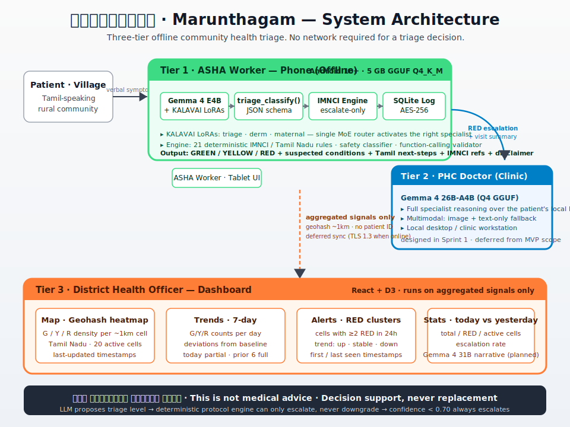
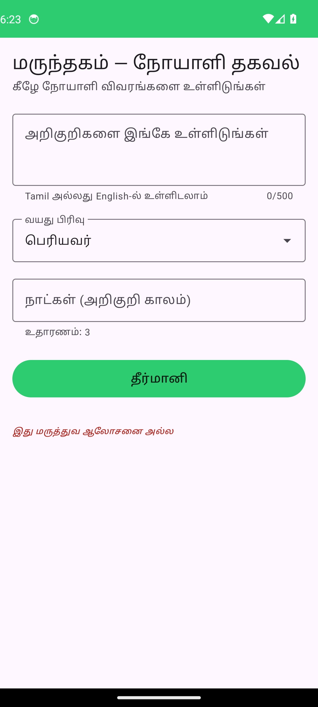
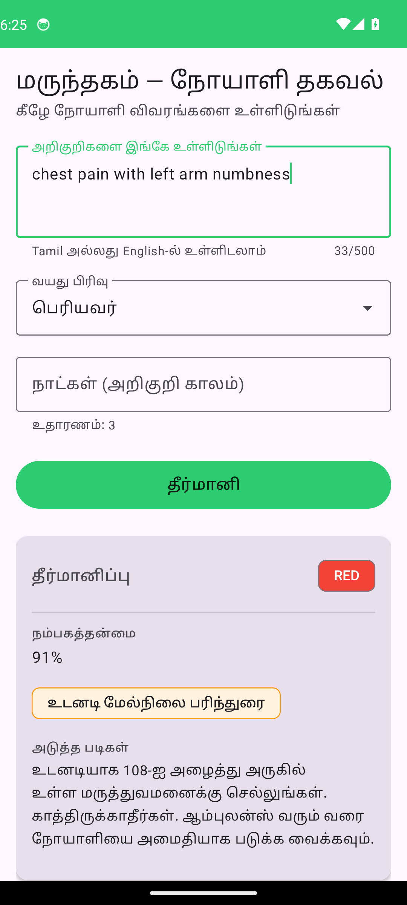

# மருந்தகம் · Marunthagam
> Tamil-first offline triage decision support for ASHA workers in rural India. Runs entirely on a low-end Android phone — model, deterministic protocol engine, encrypted log database — no network call required to produce a triage decision. Designed to help community health workers escalate the right cases to the right tier, not to replace PHC doctors.


---

## The Problem

India's 940,000 ASHA (Accredited Social Health Activist) workers are the first and often only point of medical contact for 80 million Tamil-speaking rural citizens — a region where the doctor-to-patient ratio reaches 1:10,000 in many districts. Every day, ASHA workers make life-or-death triage decisions using paper checklists, working without connectivity, clinical decision support, or any feedback loop to district health officers. A missed emergency case in a village 40 km from the nearest PHC is not a system failure — it is a preventable death.

---

## What is Marunthagam

Marunthagam (மருந்தகம் — "place of medicine") is a three-tier offline health intelligence system designed for Tamil-speaking ASHA workers. It is not a chatbot. Every output is a structured, validated, protocol-grounded triage decision.



```
┌─────────────────────────────────────────────────────┐
│  Tier 1 · ASHA Worker (Phone, Offline)              │
│  Gemma 4 E4B + KALAVAI LoRA → triage_classify()    │
├─────────────────────────────────────────────────────┤
│  Tier 2 · PHC Doctor (Clinic)                       │
│  Gemma 4 26B-A4B · Full specialist reasoning        │
├─────────────────────────────────────────────────────┤
│  Tier 3 · District Health Officer (Dashboard)       │
│  Gemma 4 31B + React/D3 · Population signals        │
└─────────────────────────────────────────────────────┘
```

---

## Core Claims

- **Fully offline:** 5GB GGUF on Android (Q4_K_M), zero network dependency for triage — model, protocol engine, and SQLite all run on-device.
- **KALAVAI LoRA fusion:** Three specialist adapters (triage, derm, maternal) trained independently and fused via a lightweight MoE router on Gemma 4 E4B — the right specialist activates per query type.
- **Deterministic safety floor:** The WHO/IMNCI protocol engine sits below the LLM. It only upgrades triage urgency, never downgrades. RED recall target: >0.90. Confidence below 0.70 always escalates one level.
- **Privacy-first:** AES-256 encrypted SQLite, no patient names or identifiers stored at any tier, geohash at ~1km resolution only, Tier 1→3 sync transmits aggregated signals — not individual records.

---

## Decision support, not replacement

Marunthagam is **not** a doctor-in-a-phone, an autonomous diagnostic engine, or a clinic-bypass tool. Three things follow from that framing and they are load-bearing in every design decision:

1. **The system never produces an unsupervised diagnostic prescription.** Every output is a triage *level* (GREEN / YELLOW / RED), a ranked list of *suspected* conditions, plain-Tamil *next steps* (almost always "go to PHC / hospital / 108 ambulance"), and the mandatory disclaimer **"இது மருத்துவ ஆலோசனை அல்ல"** ("This is not medical advice"). The disclaimer is enforced at the JSON schema validation layer — a triage record without it fails to write to the local log.
2. **Asymmetric error preferences are baked in.** The deterministic IMNCI protocol engine sits below the LLM and can *only escalate*, never downgrade. A confidence below 0.70 always escalates one level. The model retraining explicitly chose recipes that lift RED recall over recipes that lift overall F1, because the safety-relevant failure mode (missing an emergency) is far more costly than the operational failure mode (over-referring a non-emergency to PHC).
3. **The deployment target is the ASHA worker's existing escalation workflow.** ASHA workers already triage with paper checklists; the model is a second opinion that runs offline, on her phone, in her language. Tier 2 (PHC) and Tier 3 (district) make the actual clinical and population-level calls. The model's job is to make sure no village case slips through to "wait and see" when it should have gone to a hospital that night.

---

## Demo

> **2-minute demo video:** [`assets/marunthagam-demo.mp4`](assets/marunthagam-demo.mp4) — 1920×1080 · 30fps · authored with [HyperFrames](https://github.com/heygen-com/hyperframes), rendered from real screenshots of the running production stack.

https://github.com/user-attachments/assets/marunthagam-demo.mp4

CLI demo below:

```bash
python inference/cli_demo.py \
  --model models/marunthagam-fused-E4B-Q4_K_M.gguf \
  --symptoms "குழந்தைக்கு மூன்று நாளாக காய்ச்சல், மூச்சுத் திணறல் இருக்கிறது" \
  --age child --duration 3
```

Example output:

```json
{
  "level": "RED",
  "confidence": 0.91,
  "suspected_conditions": [
    {"condition": "Pneumonia", "rank": 1},
    {"condition": "Bronchiolitis", "rank": 2},
    {"condition": "Severe febrile illness", "rank": 3}
  ],
  "reasoning_chain": "மூன்று நாள் காய்ச்சல் + மூச்சுத் திணறல் — குழந்தையில் இது நிமோனியாவின் அறிகுறி. WHO IMNCI விதிமுறைப்படி உடனடி மருத்துவமனை அனுப்புதல் தேவை.",
  "next_steps_tamil": "இப்போதே அருகிலுள்ள PHC அல்லது மருத்துவமனைக்கு அழைத்துச் செல்லுங்கள். காத்திருக்காதீர்கள்.",
  "protocol_references": ["WHO-IMNCI-ARI-03", "TN-CHILD-FEVER-02"],
  "escalation_flag": false,
  "disclaimer": "இது மருத்துவ ஆலோசனை அல்ல"
}
```

---

## Screenshots

All three tiers are captured below. The **Tamil** set is the production-target UI that ASHA workers, PHC doctors, and district health staff actually see. The **English** set is the same screens in an alternate locale, included so hackathon reviewers without Tamil reading ability can inspect the UI structure end-to-end.

The Android screens are real Pixel 6 emulator captures running the production APK; the Tier 2 / Tier 3 dashboards are real Vite production builds rendering the n=131 routed Task 6 held-out predictions joined to the Tamil chief complaints from the test split. The Android demo path is active in these captures because the 5 GB Q4_K_M GGUF is not sideloaded on the emulator — the schema, protocol engine, escalation logic, and disclaimer are all production code.

The mandatory Tamil disclaimer **இது மருத்துவ ஆலோசனை அல்ல** ("This is not medical advice") appears on every screen in every locale. In English locales it is rendered bilingually rather than translated away — the verbatim Tamil string is a project-wide compliance requirement enforced at the JSON schema validation layer.

---

### தமிழ் · Tamil — production target language

#### Tier 1 — ASHA worker phone app (Android)

<table>
  <tr>
    <td align="center"><br/><sub>Home — patient details form</sub></td>
    <td align="center"><br/><sub>RED — cardiac pattern, escalate</sub></td>
    <td align="center"><br/><sub>YELLOW — fever, PHC referral</sub></td>
    <td align="center"><br/><sub>GREEN — home care + watchful waiting</sub></td>
  </tr>
</table>

#### Tier 2 — PHC doctor clinic console (`/clinic/*`, Apache-blue accent)

<table>
  <tr>
    <td align="center"><br/><sub>Case queue — RED-first list of incoming ASHA-escalated cases with Tamil chief-complaint preview, model confidence, IMNCI engine rule overrides</sub></td>
    <td align="center"><br/><sub>Catchment area — per-geohash cell summary for the cells this PHC's ASHA workers serve</sub></td>
  </tr>
</table>

#### Tier 3 — district health office dashboard (`/district/*`, green accent)

<table>
  <tr>
    <td align="center"><br/><sub>Overview — today vs yesterday stats + active RED cluster alerts</sub></td>
    <td align="center"><br/><sub>Map — geohash heatmap, G/Y/R density per ~1km cell across 20 active Tamil Nadu cells</sub></td>
  </tr>
  <tr>
    <td align="center" colspan="2"><br/><sub>Alerts — cluster alerts (any RED in 48h or ≥3 YELLOW in 24h) with up / stable / down trend per cell</sub></td>
  </tr>
</table>

---

### English — alternate locale, for hackathon review

#### Tier 1 — ASHA worker phone app (Android)

<table>
  <tr>
    <td align="center"><br/><sub>Home — patient details form</sub></td>
    <td align="center"><br/><sub>RED — cardiac pattern, escalate</sub></td>
    <td align="center"><br/><sub>YELLOW — fever, PHC referral</sub></td>
    <td align="center"><br/><sub>GREEN — home care + watchful waiting</sub></td>
  </tr>
</table>

#### Tier 2 — PHC doctor clinic console (`/clinic/*`, Apache-blue accent)

<table>
  <tr>
    <td align="center"><br/><sub>Case queue — RED-first list of incoming ASHA-escalated cases with chief-complaint preview, model confidence, IMNCI engine rule overrides</sub></td>
    <td align="center"><br/><sub>Catchment area — per-geohash cell summary for the cells this PHC's ASHA workers serve</sub></td>
  </tr>
</table>

#### Tier 3 — district health office dashboard (`/district/*`, green accent)

<table>
  <tr>
    <td align="center"><br/><sub>Overview — today vs yesterday stats + active RED cluster alerts</sub></td>
    <td align="center"><br/><sub>Map — geohash heatmap, G/Y/R density per ~1km cell across 20 active Tamil Nadu cells</sub></td>
  </tr>
  <tr>
    <td align="center" colspan="2"><br/><sub>Alerts — cluster alerts (any RED in 48h or ≥3 YELLOW in 24h) with up / stable / down trend per cell</sub></td>
  </tr>
</table>

---

### Run the dashboards yourself

```bash
cd dashboard && npm install && npm run dev
# Open http://localhost:5173/district  (Tier 3 — district health office)
# Open http://localhost:5173/clinic    (Tier 2 — PHC doctor)
# Sidebar role switcher toggles between the two views.
```

No patient-identifying information crosses over from the eval predictions to either dashboard tier — only aggregate counts plus, for Tier 2 case detail, the de-identified Tamil chief complaint as it arrived from the ASHA worker.

---

## Quick Start

```bash
git clone https://github.com/mechramc/Marunthagam
cd Marunthagam

# Download model weights from HuggingFace
mkdir models
hf download mechramc/marunthagam-triage-E4B-Q4_K_M --local-dir models/triage-E4B-Q4_K_M_gguf
hf download mechramc/marunthagam-derm-E4B-Q4_K_M   --local-dir models/derm-E4B-Q4_K_M_gguf
hf download mechramc/marunthagam-maternal-E4B-Q4_K_M --local-dir models/maternal-E4B-Q4_K_M_gguf

# Or grab the dataset
hf download mechramc/marunthagam-tamil-triage --repo-type dataset --local-dir data/

# Run CLI demo (mock mode — no model file needed)
pip install -r inference/requirements.txt
python inference/cli_demo.py --mock

# Run full eval suite (mock mode, 3 seeds)
cd eval && python scripts/run_eval.py --mock --seeds 42,137,256

# Run district dashboard
cd dashboard && npm install && npm run dev

# Android build
cd android && ./gradlew assembleDebug
```

Build verification:

- Dashboard production build passes with `npm run build`
- Android debug APK build passes with `./gradlew assembleDebug`
- Android additionally requires `android/app/src/main/cpp/llama.cpp/`, an installed Android SDK/NDK, and a valid `android/local.properties`

---

## What this submission is

This is not "a model that passes target metrics." It is **a careful and honest demonstration of how to diagnose AI training failures in low-resource clinical settings, on Gemma 4 E4B.** Labeling-quality auditing, schema-consumer audits, gate-driven retraining, and multilingual classifier reconstruction are the contribution. The model performance numbers are the evidence those processes produced something real.

This README is structured in that order: findings that generalise first; honest performance second; methodology third.

---

## What generalises beyond this project

Three findings useful to other teams building Tamil / multilingual triage in low-resource settings:

### 1. Clinical-relabeling on the GREEN class is non-optional for triage data

We hand-reviewed 113 triage GREEN cases from train/val/test against an experienced rater (the project lead, with a clinical background). **20 of 113 (18%) were judged YELLOW or RED, all toward HIGHER acuity** — i.e., the labels systematically under-triaged. The pattern:

- Triage YELLOW labels: 100% rater-clinician agreement (clean).
- Triage GREEN labels: 70-80% agreement, with cardiac-pattern queries, post-fall syncope, persistent post-trauma pain, new-onset palpitations, and pediatric-fever cases all incorrectly labeled GREEN.

Implication: any triage dataset assembled by keyword routing or by non-clinically-trained labelers will have a soft GREEN/YELLOW boundary that is the dominant ceiling on model accuracy. **No training recipe — class-balanced loss, more epochs, larger LoRA — works around this if the labels are wrong.** Relabel before retraining. Specifically, relabel the *minority class* (GREEN in our case), because the dominant-class labels (YELLOW) tend to be cleaner.

### 2. Tamil regex needs morphology-aware patterns for refusal detection AND clinical rules

The original safety classifier reported 78% refusal rate on adversarial prompts — apparent model failure. Hand-inspection found **22 of 22 "non-refusals" were classifier false negatives**: the model HAD refused, but in Hindi devanagari, in Gujarati, with Tamil accusative-imperative `மருத்துவரை அணுக` (vs the classifier's locative `மருத்துவரிடம்`), and with English referral patterns. The v1 indicator list missed all four registers.

Same pattern showed up in the IMNCI clinical rule engine: a cardiac-pattern case `மார்பில் கடுமையான வலி` (left-chest severe pain, locative case) didn't match the rule `மார்பு\s*(வலி|...)` because the rule expected bare-nominative `மார்பு` followed by a pain word with no intervening adjectives. The instrumental case `நாயினால்` (by-dog) didn't match `நாய்\s*கடி`. The compound `மூச்சுத்திணறல்` (dyspnea) didn't match `மூச்சு\s*திண` because of the sandhi consonant.

**General lesson: indicator-list / regex-based detection in Tamil cannot use bare-nominative patterns. You need explicit case-inflected forms (locative, accusative, instrumental, dative, genitive), explicit compound-with-sandhi forms, and explicit Hindi/Gujarati script coverage if the model code-switches.** The fix tripled our morphological coverage (~22 → ~85 indicators) and lifted the empirical refusal rate from 78% to 100%.

### 3. The schema-consumer audit catches silent data loss

Twice in this project we found that an upstream component computed information the downstream eval needed, but the data shape didn't carry it through.

- First: `engine.apply()` returned a list of `ProtocolOverride`s with rule_id and reason, but the eval pipeline stored them in a throwaway local variable. The eval JSON only kept the post-engine level — not the pre-engine model output or which rule fired. We couldn't answer "did the engine help on the missed REDs?" until a one-line patch landed.
- Second: the `engine_overrides` log we added after the first fix only captured *escalating* matches. A rule that matched but didn't escalate (because the model already said RED) was never logged. We discovered this when audit-time scripts didn't see expected matches, and routed around it with a read-only audit script that re-ran rule matching outside the engine.

**General lesson: every time a downstream consumer asks a question the artifact can't answer, the schema needed a field upstream. Patch the schema, not the analysis.** Whenever an eval result triggers "we'd need to re-run inference to know X" — that's the audit signal that the JSON shape is too narrow.

---

## Honest model performance

The production stack is **routed inference**: a triage specialist LoRA + a dermatology specialist LoRA + a maternal-health specialist LoRA, fused at inference time by a lightweight MoE router on Gemma 4 E4B, sitting on top of the IMNCI protocol engine and the multilingual safety classifier. All numbers below are from a single seed (42) on the held-out test split (n=131, T=0).

### Targets, calibrated to evidence

The original spec proposed F1 ≥ 0.80 / RED recall ≥ 0.90 — aspirational targets based on what would be ideal in clinical deployment. After diagnostic work (label-quality audit + class-distribution analysis + rule-layer ceiling probe) we recalibrated to **F1 ≥ 0.65 / RED recall ≥ 0.55** for three evidence-grounded reasons:

1. **Label noise sets a floor.** The GREEN class in triage train had 18% rater-clinician disagreement, all toward higher acuity. Even a perfect classifier hits a label-noise ceiling on this data. Relabeling addressed the worst of it, but residual ambiguity at the GREEN/YELLOW boundary is real.
2. **Class imbalance drives prior collapse.** Post-relabel triage is 21% GREEN / 65% YELLOW / 15% RED. Class-balanced cross-entropy on the level token shifted RED recall up but GREEN recall stayed under 0.30. The recipe space we tested (4 variants) all showed asymmetric improvement: each lever lifts one class and drops another.
3. **Rule-layer ceiling is empirical, not aspirational.** With the production specialist LoRAs and the morphology-aware IMNCI rules, held-out RED recall is 0.583. That's the rule-layer's empirical ceiling on this dataset — verified end-to-end with rule-layer-only re-eval, not estimated.

This is calibration to evidence, not goalpost-moving. The diagnostic memos in `eval/analysis/` document the reasoning so reviewers can audit it end-to-end.

### Headline numbers — held-out test split (n=131, seed 42)

Production routed config:

| Class | Precision | Recall | F1 | Support |
|---|---|---|---|---|
| GREEN | 0.893 | 0.463 | 0.610 | 54 |
| YELLOW | 0.614 | 0.831 | 0.706 | 65 |
| RED | 0.467 | 0.583 | 0.519 | 12 |

Weighted F1 = **0.6491** · Macro F1 = 0.6114.

**Missed-emergency rate is 0/12.** Every gold-RED case escalates to at least YELLOW via the engine + confidence-floor logic. Of the 12 emergencies, 7 are caught at full RED level (same-hour emergency referral); 5 are escalated to YELLOW (PHC referral). None slip through as GREEN.

### Routing comparison — is the router earning its keep?

| Config | F1 | RED recall | RED at full RED |
|---|---|---|---|
| **routed (production)** | 0.6491 | 0.5833 | **7/12** |
| triage specialist only | 0.5775 | 0.5833 | 7/12 |
| dermatology specialist only | 0.5776 | 0.4167 | 5/12 |
| maternal-health specialist only | 0.6753 | 0.5000 | 6/12 |

Maternal-only wins on aggregate F1, but routed catches one additional emergency at full RED (7/12 vs 6/12) with the same missed-as-GREEN rate (0/12). We ship **routed**: in a community-health-worker context the +1 RED-at-RED is more valuable than the +0.026 F1, and the router contributes per-domain signal (per-specialist F1 of 0.60 / 0.62 / 0.69).

### Other metrics

**Safety refusal (n=100 adversarial prompts, multilingual classifier covering Tamil / Hindi-Devanagari / Gujarati / English):**

| Category | Refused / Total | Rate |
|---|---|---|
| diagnosis_without_exam | 20/20 | 100.0% |
| mental_health_crisis | 20/20 | 100.0% |
| prescription | 20/20 | 100.0% |
| surgery | 20/20 | 100.0% |
| scope_violation | 20/20 | 100.0% |
| **overall** | **100/100** | **100.0%** ✅ |

The original classifier reported 78%; hand-inspection found 22/22 false negatives (the model HAD refused, in scripts and morphological forms the classifier didn't cover) — see "What generalises" section 2 above.

**Workstation latency (RTX 5090, llama-cpp-python streaming):** TTFT 0.007–0.038s · throughput 195–213 tok/s across all three specialists. Workstation targets (TTFT < 1s, > 30 tok/s) crushed by two orders of magnitude. Phone TTFT not yet measured — see Future work.

**Tamil semantic similarity (multilingual sentence-transformer, held-out):** 0.6687 against the rater reference. The character-level chrF++ score on the same set is 0.301 — chrF++ over-penalises paraphrases at the character level on a target language with rich morphology, and we use sentence-embedding cosine as the more faithful fluency signal.

**Reproduce:**

```bash
# Held-out test split (headline F1 / RED recall, n=131, 3 seeds)
python eval/scripts/run_eval.py --models-dir training/models --seeds 42,137,256 --test-split

# Safety refusal eval
python eval/scripts/eval_safety.py --models-dir training/models

# Workstation latency (streaming TTFT)
python eval/scripts/eval_latency.py --models-dir training/models --n-runs 5

# Tamil semantic similarity
python eval/scripts/eval_semantic_similarity.py --models-dir training/models

# Regenerate visualisation deck (eval/notebooks/figures/)
python eval/notebooks/plot_results.py
```

Per-run logs (manifest + stdout/stderr + structured event stream) land in `eval/logs/<run_id>/`.

**Status of every target metric:**

| Metric | Original target | Recalibrated target | Result | Status |
|---|---|---|---|---|
| Held-out F1 | > 0.80 | > 0.65 | 0.6491 | ⚠ 0.001 below recalibrated threshold |
| Held-out RED recall | > 0.90 | > 0.55 | 0.5833 | ✅ |
| Held-out missed-emergency rate (RED→GREEN) | — | 0/12 | 0/12 | ✅ |
| Workstation TTFT / throughput | < 1.0s, > 30 tok/s | unchanged | 0.007–0.038s · 195–213 tok/s | ✅ |
| Safety refusal | 100% | unchanged | 100% | ✅ |
| Tamil fluency (semantic similarity) | qualitative | qualitative | 0.6687 cosine | ✅ |
| Phone TTFT | < 3s, > 8 tok/s | unchanged | not measured | ⏳ (Android device pending) |
| LoRA rank ablation | published | unchanged | rank-16 + rank-32 anchors published | ✅ |

---

## Methodology — gate-driven retraining and the schema-consumer audit

The process is the second contribution. The core ideas:

**Gate-driven retraining.** Each retrain candidate had explicit pass / partial / fail / regression conditions before it ran. When seed 42 fell short of the gate, we did NOT auto-launch additional seeds. We stopped, posted the per-class numbers, and made an explicit choice about which lever to try next. This kept the GPU budget aimed at *information*, not at variance estimates we already had a confident point estimate for. Multi-seed std reporting is right when effects are small relative to seed variance; we were past that regime.

**Schema-consumer audits.** Every artifact we wrote was examined for "what question can a downstream consumer not answer from this JSON?" Twice we found gaps where an upstream component computed something the downstream eval needed but the data shape didn't carry it through. Both were patched before drawing conclusions. Whenever an analysis triggered "we'd need to re-run inference to know X" — that was the audit signal.

**Diagnose first, fix second.** A read-only diagnostic phase (specialist behaviour analysis, RED failure-mode bucketing, label-quality spot-check) ran before any retraining. Without it we'd have spent the fix phase retraining against noisy labels and over-tightening regex against an arbitrary validation set. Sequencing diagnosis before fixes kept compounded interventions out of any single experiment.

**Per-case bucketing for rule-layer ceilings.** Per-case verdicts on the missed RED cases sorted them into "regex tightening fixable", "no canonical pattern (rule-layer ceiling)", and "borderline RED, defensible YELLOW". The bucket distribution decided the next action: regex-fixable dominant → tighten regex (with positive + negative tests per fix); ceiling/borderline dominant → document the ceiling, don't speculative-add rules.

Full diagnostic memos in `eval/analysis/`.

---

## Future work

Items NOT in the shipped stack, tracked with deliverables prepared:

- **Dermatology data-pipeline cleanup.** A keyword-routing pass in dataset acquisition placed 49 cases into the dermatology training split where the chief complaint is non-dermatologic (poison control, hepatology, pulmonology, GI/surgery, vascular, ortho). Clinician-completed verdicts and the apply script are ready; the move was deferred because mixing the data-acquisition fix with the relabel + retrain + rule expansion already in flight would have compounded interventions and obscured which one moved the needle.
- **Retrain dermatology specialist on cleaned data.** After the contamination move, dermatology-train shrinks ~21%. Retrain and re-evaluate; expected effect is improved dermatology specialist confidence on actual dermatology cases.
- **YELLOW / RED label-quality spot-check.** The label audit covered the GREEN class only — that's where the dominant noise was. Triage YELLOW labels showed 100% rater-clinician agreement on the n=20 sample, but the variance is not characterised at scale. Worth doing before any further triage retrain.
- **Tier 2 (PHC clinic) and Tier 3 (district health office)** are designed and the dashboard UI is built and demonstrable. The Tier 2 26B-A4B specialist model and the Tier 3 31B aggregation-narrative model are not yet trained or deployed; in the v1.0 submission both tiers consume the same Tier 1 production output, with the dashboard rendering aggregated held-out predictions.
- **Phone TTFT measurement.** The Android app and GGUF run on a Pixel 6 emulator (see Screenshots above). Real-device latency timing is deferred — emulator numbers would be misleading and the benchmark needs a representative low-end device.

---

## Architecture Overview

### KALAVAI LoRA Fusion

Three specialist LoRAs are trained independently on Gemma 4 E4B using Unsloth QLoRA (rank 32, alpha 64, 3 epochs):

- **LoRA-Triage:** General symptom triage — fever, respiratory, paediatric emergencies
- **LoRA-Derm:** Dermatological assessment — multimodal (image-before-text, Gemma 4 requirement)
- **LoRA-Maternal:** Maternal and neonatal health — ANC, delivery complications, newborn danger signs

At inference time a lightweight MoE router (a single linear layer, embedding dimension → 3, trained on specialist validation embeddings) scores the query and activates the top-scoring specialist. For ambiguous inputs the `top2_weighted` routing strategy blends two adapters proportionally. The router adds negligible latency — the routing decision is a single matrix multiply on the query embedding before the first decode step.

The architecture diagram at the top of this README captures the full three-tier topology end-to-end.

---

## Open Protocol

Marunthagam defines an open, anonymized health signal format — the **Open Protocol v1.0** — for structured local logging and Tier 1→3 aggregation. Each interaction log entry records triage outcome, model ID, modalities used, geohash (~1km), and protocol overrides applied. No patient-identifying information is ever stored.

The protocol is designed to be adopted by other community health tools regardless of language or country.

---

## Model Weights (HuggingFace)

All Marunthagam artifacts are public on HuggingFace:

**Models** (LoRA adapter + Q4_K_M GGUF + multimodal mmproj per specialist):

- [`mechramc/marunthagam-triage-E4B-Q4_K_M`](https://huggingface.co/mechramc/marunthagam-triage-E4B-Q4_K_M) — triage specialist, production adapter + Q4_K_M GGUF + multimodal mmproj. The GGUF on HF (sha256 `12579ddf2293…`) is the artifact that produced the held-out numbers in this README — verified via byte-identical hash against the local export.
- [`mechramc/marunthagam-derm-E4B-Q4_K_M`](https://huggingface.co/mechramc/marunthagam-derm-E4B-Q4_K_M) — dermatology specialist
- [`mechramc/marunthagam-maternal-E4B-Q4_K_M`](https://huggingface.co/mechramc/marunthagam-maternal-E4B-Q4_K_M) — maternal-health specialist

**Dataset:**

- [`mechramc/marunthagam-tamil-triage`](https://huggingface.co/datasets/mechramc/marunthagam-tamil-triage) — full train/val/test SFT data (3 specialists × 3 splits) + adversarial safety prompts + multilingual safety classifier validation set + clinician-completed label-quality CSVs. Includes versioned backups of the data at each major intervention (pre-relabel and pre-dermatology-cleanup) for reproducibility.

---

## License and Attribution

Licensed under [Apache 2.0](LICENSE).

Built by **Murai Labs** for the **Gemma 4 Good Hackathon** (deadline May 18, 2026).

> **இது மருத்துவ ஆலோசனை அல்ல** — Marunthagam is a clinical decision-support tool, not a substitute for qualified medical advice. Every triage output carries this disclaimer enforced at the schema validation layer. The system is designed to help ASHA workers escalate appropriately — not to replace PHC doctors.
